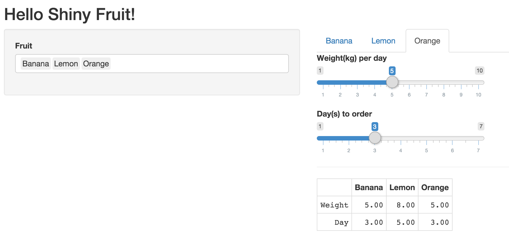

# dynamic-tabsetPanel
A Shiny dynamic tabsetPanel demo 

It is a demo to show how to use a dynamic input to update tab panles dynamically.

Every tab contains serveral components, which are also create dynamically.

At the bottom there is a realtime updated table to show all parameters. 
